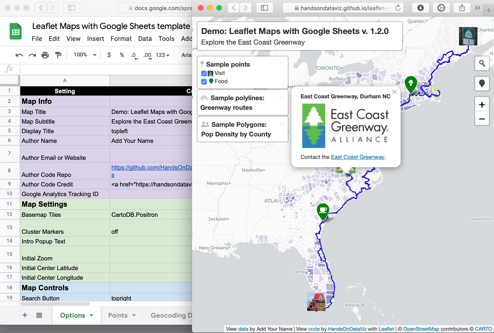

# Leaflet Maps with Google Sheets
Customize Leaflet maps with a linked Google Sheets template or CSV files and GeoJSON data on GitHub

## Live links (replace with your own)
- Leaflet Map https://handsondataviz.github.io/leaflet-maps-with-google-sheets/
- Google Sheets template https://docs.google.com/spreadsheets/d/1ZxvU8eGyuN9M8GxTU9acKVJv70iC3px_m3EVFsOHN9g/edit#gid=0

## Create your own
See step-by-step tutorial in *Hands-On Data Visualization* https://handsondataviz.org/leaflet-maps-with-google-sheets.html

#### Geocode your address data with Google Sheets add-on
To geocode (find latitude and longitude coordinates), we recommend installing the free [Geocoding by SmartMonkey add-on for Google Sheets](https://gsuite.google.com/marketplace/app/geocoding_by_smartmonkey/1033231575312). Use Geocoding > Create Template menu, insert your addresses in place of samples, and then use Geocoding > Geocode Details menu. Learn more in *Hands-On Data Visualization* https://handsondataviz.org/geocode.html

#### To finalize your map, you need to either:
- Save each Google Sheets tab as a CSV file and upload to GitHub
  - OR
- Get your own Google Sheets API Key to insert into the code

See Steps G or H in the tutorial https://handsondataviz.org/leaflet-maps-with-google-sheets.html

#### Problem: The map I created here before September 2020 is not working
Google Sheets changed its API from version 3 to version 4 in September 2020, which breaks prior versions of the map, so we made several updates to the code. To make your pre-Sept 2020 maps work again, here are three options, A-B-C:

Option A: Use your existing code and pull your data from CSV files rather than a linked Google Sheet.

1. Go to your linked Google Sheet, and for each tab, *File > Download* in CSV format, and rename them this way: Options.csv, Points.csv, etc.
2. Log into the web interface of your GitHub map repo.
3. Create a new subfolder named `csv` in your GitHub repo. Go to *Add file > Create a file* and type in `csv/`. The forward slash indicates it is a folder, not a file). 
4. Upload each CSV file you created into this new `csv` subfolder in GitHub. The code automatically searches for CSV files before searching for a linked Google Sheet, which means your Google Sheet is no longer needed.

OR

Option B: Make a copy of our newer code by clicking the green 'Use template' button. Migrate any media or geodata content from your old repo to your new repo. Reconnect your Google Sheet to your new repo. 

OR

Option C: Use GitHub Desktop to move copies of the newer code (index.html, scripts folder, etc.) into your repo via your local computer. 

## Credits (and licenses)
Developed by [Ilya Ilyankou](https://github.com/ilyankou) and [Jack Dougherty](https://github.com/jackdougherty) with support from Trinity College CT, and inspired by Code for Atlanta mapsfor.us (2016) https://github.com/codeforatlanta/mapsforus (BSD-3-Clause)

We use [Google Sheets API version 4](https://developers.google.com/sheets/api), with these open-source components:

- Leaflet v1.7.1 https://leafletjs.com (BSD-2-Clause)
- jQuery v3.5.1 https://code.jquery.com (MIT)
- PapaParse v5.3.0 to parse CSV with JavaScript (MIT)
- Font Awesome (v4.7) https://cdn.fontawesome.com (MIT, SIL OFL 1.1)
- leaflet-providers (v1.10.2) https://github.com/leaflet-extras/leaflet-providers (BSD-2-Clause)
- Leaflet.awesome-markers (v2.0.4), manually updated to svg to allow hex and material icons https://github.com/sigma-geosistemas/Leaflet.awesome-markers (MIT)
- Leaflet.markercluster (v1.4.1) https://github.com/Leaflet/Leaflet.markercluster (MIT)
- Leaflet.MarkerCluster.LayerSupport (v.2.0.1) https://github.com/ghybs/Leaflet.MarkerCluster.LayerSupport (MIT)
- Leaflet Control Geocoder v1.13.0 https://github.com/perliedman/leaflet-control-geocoder (BSD 2-Clause)
- leaflet-locatecontrol (v0.72.0) https://github.com/domoritz/leaflet-locatecontrol (MIT)
- jQuery-CSV (v1.0.11) https://github.com/evanplaice/jquery-csv (MIT)
- DataTables (v1.10.22) by SpryMedia Ltd. https://datatables.net (MIT)
- Material icons https://material.io/resources/icons/ (Apache)
- Single Element CSS Spinner (31 May 2016) https://github.com/lukehaas/css-loaders (MIT)
- Google Colour Palette Generator (2015) https://github.com/google/palette.js (MIT)
- polylabel (Dec. 2016 customized) https://github.com/mapbox/polylabel to optimally place text labels in a polygon (ISC), with TinyQueue (v1.1.0) (https://github.com/mourner/tinyqueue), polylabel's dependency (ISC)
